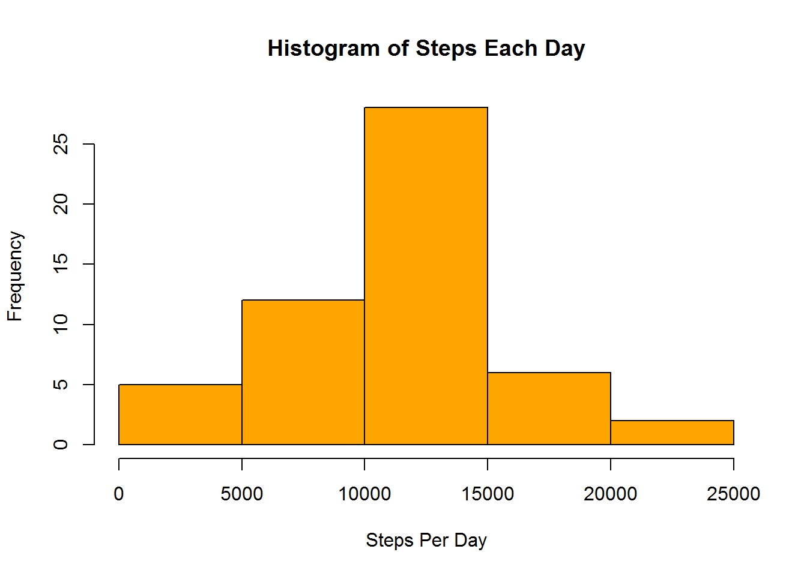
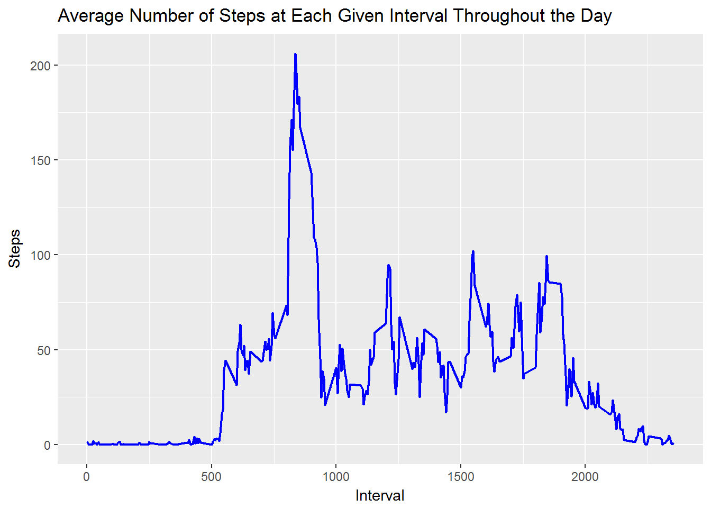
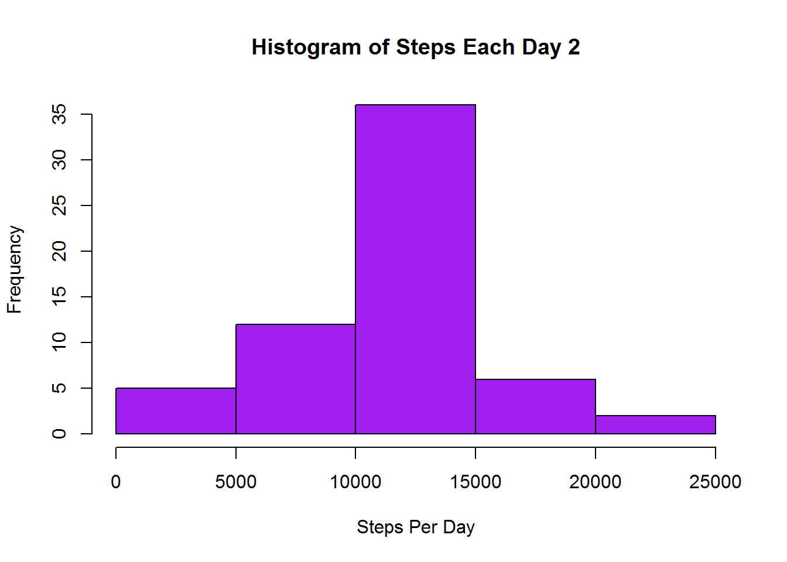
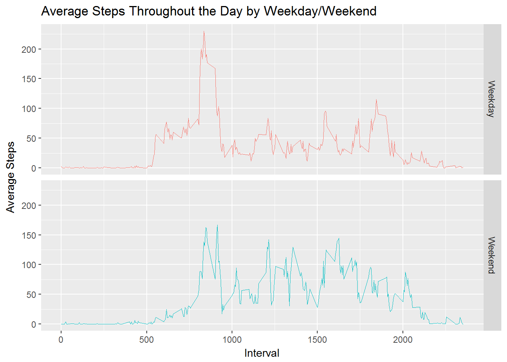

Peer Graded Assignment: Course Project 1
=========================================

Read in the data and reformat the date column to be in a true date format


```r
activity<-read.csv("C://Users//Luke.Munyan//Documents//activity.csv", header=TRUE,stringsAsFactors = FALSE)
activity$date<-as.Date(activity$date, "%Y-%m-%d")
str(activity)
```

```
## 'data.frame':	17568 obs. of  3 variables:
##  $ steps   : int  NA NA NA NA NA NA NA NA NA NA ...
##  $ date    : Date, format: "2012-10-01" "2012-10-01" ...
##  $ interval: int  0 5 10 15 20 25 30 35 40 45 ...
```

Next, we will calculate total steps each day.  We will make a histogram of the data to see what the most common step counts in a given day are.


```r
daily.steps<-aggregate(steps~date, data=activity, sum, na.rm=TRUE)
names(daily.steps)<-c("Date", "Steps")
```


```r
hist(daily.steps$Steps, main="Histogram of Steps Each Day", xlab="Steps Per Day", col="orange")
```



Now we will look at the mean and median number of steps per day.


```r
mean(daily.steps$Steps)
```

```
## [1] 10766.19
```

```r
median(daily.steps$Steps)
```

```
## [1] 10765
```

What does the daily activity pattern look like?


```r
average_steps<-aggregate(steps~interval, data=activity, mean, na.rm=T)

names(average_steps)<-c("Interval", "Steps")
```


```r
require(ggplot2)
```


```r
ggplot(average_steps, aes(Interval, Steps))+geom_line(color="blue", size=.75)+ggtitle("Average Number of Steps at Each Given Interval Throughout the Day")
```



Which 5-minute interval, on average across all the days in the dataset, contains the maximum number of steps?


```r
max.int<-average_steps[average_steps$Steps==max(average_steps$Steps),]
max.int[,1]
```

```
## [1] 835
```

How many missing values are there in the dataset?


```r
nrow(activity[is.na(activity$steps),])
```

```
## [1] 2304
```

We will fill the missing values with the overall average number of steps for the given interval the data is missing for. I will add a new row to the original data fram called "new steps" which will fill in the NA averages for that interval, and keep the actual (non-na) values that were already present in the steps column. 


```r
activity$newsteps<-ifelse(is.na(activity$steps)==TRUE, tapply(activity$steps,activity$interval, mean, na.rm=T), activity$steps)
```

Aggregate the data now that there are no missing values


```r
new.daily.steps<-aggregate(newsteps~date, data=activity, sum, na.rm=TRUE)
names(new.daily.steps)<-c("Date", "Steps")
```

Histogram with missing data filled in.


```r
hist(new.daily.steps$Steps, main="Histogram of Steps Each Day 2", xlab="Steps Per Day", col="purple")
```



Mean and Median


```r
mean(new.daily.steps$Steps)
```

```
## [1] 10766.19
```

```r
median(new.daily.steps$Steps)
```

```
## [1] 10766.19
```

What is the difference between weekend and weekday activity patterns?
First we will create a new column/variable


```r
for(i in 1:nrow(activity)){
if(weekdays(activity$date[i])=="Saturday"){
    activity$week[i]<-"Weekend"
}else if(weekdays(activity$date[i])=="Sunday"){
    activity$week[i]<-"Weekend"
}else{activity$week[i]<-"Weekday"}
}
```

We will compare activity using a ggplot pannel plot after aggregating the data.


```r
new<-aggregate(newsteps~interval+week, data=activity, mean)
```


```r
ggplot(new, aes(interval, newsteps, color=week))+geom_line(size=.25, show.legend = F)+facet_grid(week~.)+xlab("Interval")+ylab("Average Steps")+ggtitle("Average Steps Throughout the Day by Weekday/Weekend")
```


